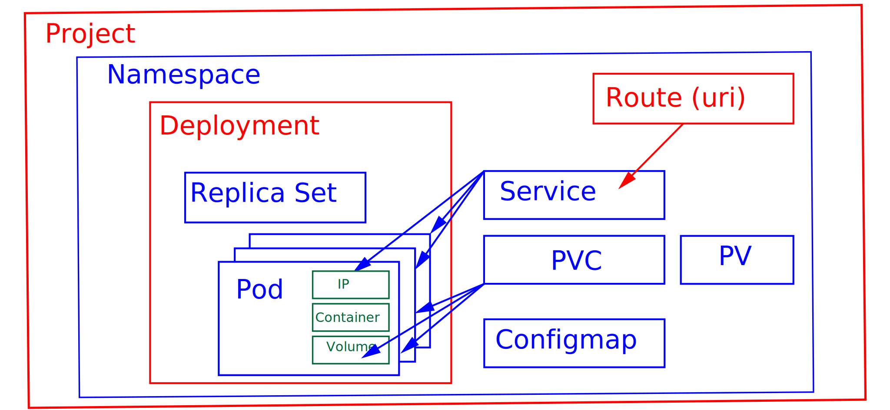

# OCP
 | The [OpenShift Container Platform](https://docs.openshift.com/container-platform/4.10/welcome/index.html) is a hybrid cloud, platform as a service, built around Linux containers. Orchestrated and managed by Kubernetes on a foundation of Red Hat Enterprise Linux.
-----------------------------------|-----------------------------------|

## resources
`oc api-resources`


resource    | description | help
------------|------------ |------------
project | Projects are the unit of isolation and collaboration in OpenShift. | oc explain project
namespace | Namespace provides a scope for Names. | oc explain namespace
pod         | Pod is a collection of containers that can run on a host. | oc explain pod 
replica set | ReplicaSet ensures that a specified number of pod replicas are running at any given time. | oc explain replicasets
deployment  | Deployment enables declarative updates for Pods and ReplicaSets. | oc explain deployment
service     | Service is a named abstraction of software service consisting of local port that the proxy listens on |oc explain service
route       | A route allows developers to expose services through an HTTP(S) aware load balancing and proxy layer via a public DNS entry. | oc explain route 
configmap | ConfigMap holds configuration data for pods to consume. | oc explain configmap 

`oc completion -h | less`

`source <(oc completion bash)`

`oc login -u developer https://api.crc.testing:6443`
```
Logged into "https://api.crc.testing:6443" as "developer" using existing credentials.

You don't have any projects. You can try to create a new project, by running

    oc new-project <projectname>
```
### Create a new project for yourself.
`oc new-project -h | less`

`oc new-project jonwalk-project01 --description='jonwalk first project'`
```
Now using project "jonwalk-project01" on server "https://api.crc.testing:6443".

You can add applications to this project with the 'new-app' command. For example, try:

    oc new-app rails-postgresql-example

to build a new example application in Ruby. Or use kubectl to deploy a simple Kubernetes application:

    kubectl create deployment hello-node --image=k8s.gcr.io/e2e-test-images/agnhost:2.33 -- /agnhost serve-hostname
```
### Create a deployment with the specified name.

`oc create deployment -h | less`

`oc create deployment jonwalk-deployment01 --image=bitnami/nginx --replicas=3`
```
deployment.apps/jonwalk-deployment01 created
```
`oc get all`
```
NAME                                       READY   STATUS    RESTARTS   AGE
pod/jonwalk-deployment01-c6d5fd98b-6zv8w   1/1     Running   0          33s
pod/jonwalk-deployment01-c6d5fd98b-ftp5z   1/1     Running   0          33s
pod/jonwalk-deployment01-c6d5fd98b-sz2fk   1/1     Running   0          33s

NAME                                   READY   UP-TO-DATE   AVAILABLE   AGE
deployment.apps/jonwalk-deployment01   3/3     3            3           34s

NAME                                             DESIRED   CURRENT   READY   AGE
replicaset.apps/jonwalk-deployment01-c6d5fd98b   3         3         3       33s
```
`oc delete pod/jonwalk-deployment01-c6d5fd98b-6zv8w`
```
pod "jonwalk-deployment01-c6d5fd98b-6zv8w" deleted
```
`oc get all`
```
NAME                                       READY   STATUS              RESTARTS   AGE
pod/jonwalk-deployment01-c6d5fd98b-b4snm   0/1     ContainerCreating   0          4s
pod/jonwalk-deployment01-c6d5fd98b-ftp5z   1/1     Running             0          18m
pod/jonwalk-deployment01-c6d5fd98b-sz2fk   1/1     Running             0          18m

NAME                                   READY   UP-TO-DATE   AVAILABLE   AGE
deployment.apps/jonwalk-deployment01   2/3     3            2           18m

NAME                                             DESIRED   CURRENT   READY   AGE
replicaset.apps/jonwalk-deployment01-c6d5fd98b   3         3         2       18m

```

`oc get all`
```
NAME                                       READY   STATUS    RESTARTS   AGE
pod/jonwalk-deployment01-c6d5fd98b-b4snm   1/1     Running   0          92s
pod/jonwalk-deployment01-c6d5fd98b-ftp5z   1/1     Running   0          20m
pod/jonwalk-deployment01-c6d5fd98b-sz2fk   1/1     Running   0          20m

NAME                                   READY   UP-TO-DATE   AVAILABLE   AGE
deployment.apps/jonwalk-deployment01   3/3     3            3           20m

NAME                                             DESIRED   CURRENT   READY   AGE
replicaset.apps/jonwalk-deployment01-c6d5fd98b   3         3         3       20m
```

### project 02 - new-app
```
oc new-project jonwalk-project02 --description='jonwalk project 02'
oc new-app bitnami/nginx --name app02
oc expose service/app02
```
### project 03 - configmap
```
oc new-project jonwalk-project03 --description='jonwalk project 03'
oc create configmap jonwalk-cm --from-file=index.html
oc create deploy jonwalk-nginx --image=bitnami/nginx
oc set volume deploy jonwalk-nginx --add --type configmap --configmap-name jonwalk-cm --mount-path=/app/
oc expose deploy jonwalk-nginx --port=8080
oc expose service/jonwalk-nginx
oc get deploy jonwalk-nginx -o yaml

oc create deploy jonwalk-mariadb --image=registry.redhat.io/rhscl/mariadb-103-rhel7
oc logs deployment.apps/jonwalk-mariadb
oc create configmap jonwalk-mariadb-vars --from-literal=MYSQL_ROOT_PASSWORD=password
oc describe configmap jonwalk-mariadb-vars
oc set env deploy jonwalk-mariadb --from=configmap/jonwalk-mariadb-vars
oc get deploy jonwalk-mariadb -o yaml

```
### project 04 - templates
```
oc new-project jonwalk-project04 --description='jonwalk project 04 templates'

oc get templates -n openshift | less
oc get template mariadb-persistent -n openshift -o yaml
oc process --parameters mariadb-persistent -n openshift
oc get template mariadb-persistent -o yaml -n openshift > mariadb-persistent.yaml
oc new-app --template=mariadb-persistent -p MYSQL_USER=jonwalk -p MYSQL_PASSWORD=password -p MYSQL_DATABASE=videos --as-deployment-config
oc get all
```
### project 06 - [wordpress](https://developer.ibm.com/tutorials/build-deploy-wordpress-on-openshift/)
```
oc new-project jonwalk-wordpress --description='jonwalk project 06 wordpress'

oc new-app mariadb-persistent
oc new-app php~https://github.com/wordpress/wordpress
oc expose service/wordpress
oc get routes
```
## project 07 
```
oc new-project jonwalk-postgresql --description='jonwalk project 07 postgresql'
oc new-app postgresql-ephemeral --name database --param DATABASE_SERVICE_NAME=database --param POSTGRESQL_DATABASE=sampledb --param POSTGRESQL_USER=username --param POSTGRESQL_PASSWORD=password
oc rollout status dc/database
oc get pods --selector name=database
POD=$(oc get pods --selector name=database -o custom-columns=NAME:.metadata.name --no-headers); echo $POD
oc rsh $POD
psql sampledb username
 \l\

CREATE TABLE COMPANY(
   ID INT PRIMARY KEY     NOT NULL,
   NAME           TEXT    NOT NULL,
   AGE            INT     NOT NULL,
   ADDRESS        CHAR(50),
   SALARY         REAL
);

\dtables

 \l
```
## ## project 08 mysql
```
oc new-project jonwalk-mysql --description='jonwalk project 08 mysql'
oc new-app mysql MYSQL_USER=user MYSQL_PASSWORD=pass MYSQL_DATABASE=testdb -l db=mysql
oc rsh mysql-77c94c9885-k8qg7 
mysql -u user -D testdb -p
```

## project 09 [pipelines-tutorial](https://docs.openshift.com/container-platform/4.8/cicd/pipelines/creating-applications-with-cicd-pipelines.html])
```
oc new-project pipelines-tutorial
oc get serviceaccount pipeline
oc create -f https://raw.githubusercontent.com/openshift/pipelines-tutorial/pipelines-1.5/01_pipeline/01_apply_manifest_task.yaml
oc create -f https://raw.githubusercontent.com/openshift/pipelines-tutorial/pipelines-1.5/01_pipeline/02_update_deployment_task.yaml

oc create -f pipeline-yaml-file-name.yaml

tkn pipeline start build-and-deploy \
    -w name=shared-workspace,volumeClaimTemplateFile=https://raw.githubusercontent.com/openshift/pipelines-tutorial/pipelines-1.7/01_pipeline/03_persistent_volume_claim.yaml \
    -p deployment-name=pipelines-vote-api \
    -p git-url=https://github.com/openshift/pipelines-vote-api.git \
    -p IMAGE=image-registry.openshift-image-registry.svc:5000/pipelines-tutorial/pipelines-vote-api \
    --use-param-defaults

tkn pipeline start build-and-deploy \
    -w name=shared-workspace,volumeClaimTemplateFile=https://raw.githubusercontent.com/openshift/pipelines-tutorial/pipelines-1.7/01_pipeline/03_persistent_volume_claim.yaml \
    -p deployment-name=pipelines-vote-ui \
    -p git-url=https://github.com/openshift/pipelines-vote-ui.git \
    -p IMAGE=image-registry.openshift-image-registry.svc:5000/pipelines-tutorial/pipelines-vote-ui \
    --use-param-defaults

oc get route pipelines-vote-ui --template='http://{{.spec.host}}'

```


